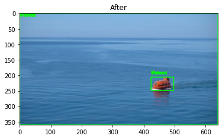
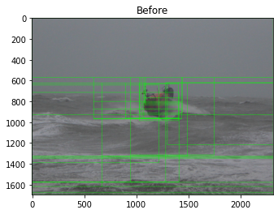
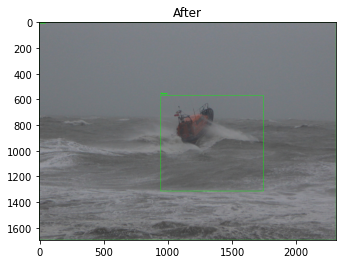

# Region Proposal Object Detection

List of the 1k objects resnet50 can identify

## background
Region Proposal algorithm = spend computation in this area of the iamge
- examines texture, size, shape, and meta-similarity of all

Any CNN can act as an object detector.

Remove image pyramid
Remove sliding window
Apply Selective Search
Use Region Proposal
Send to CNN 
Ultimately, pipeline object detection

